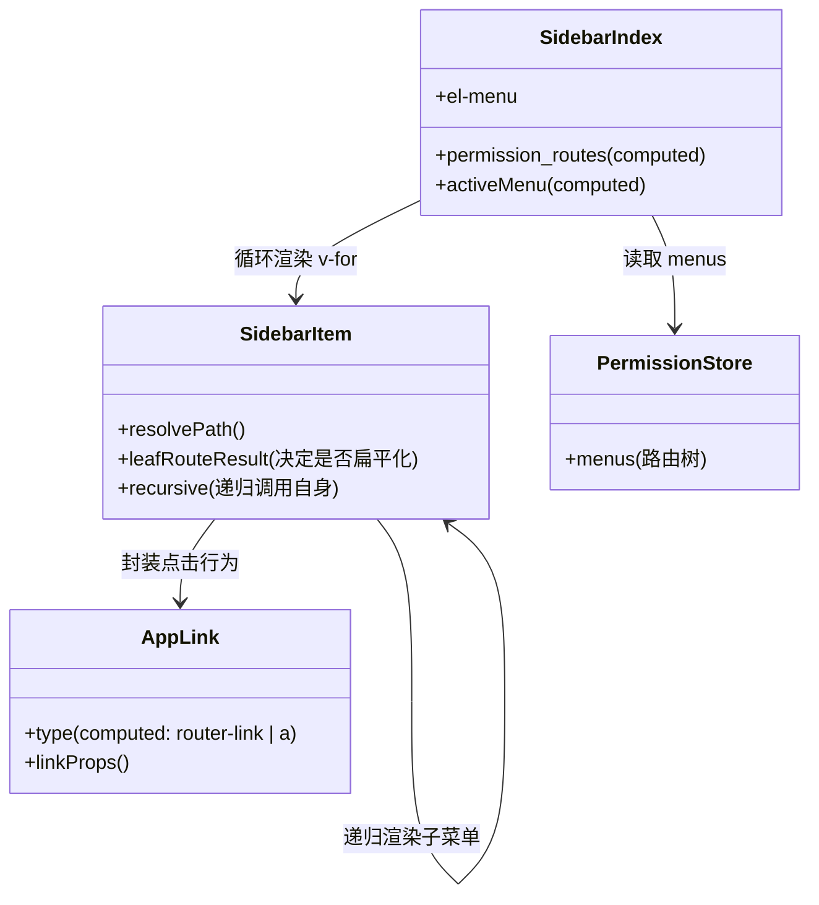

基于您提供的代码及系统上下文，以下是对 `src/layout/components/Sidebar` 模块中路由变化机制的完整分析。

### 核心机制概述

该侧边栏系统采用 **数据驱动** 的渲染模式。它不依赖手动绑定点击事件（如 `@click="goTo"`），而是通过封装 Vue Router 的 `<router-link>` 组件来实现声明式导航。

---

### 1. 完整调用链路追踪 (用户交互 -> URL 变更)

从用户点击侧边栏菜单项到页面更新，经历了以下流程：

#### **阶段一：组件渲染与点击 (Sidebar 层面)**
1.  **渲染**：`index.vue` 遍历 `permission_routes`，将路由对象通过 `props` 传递给 `SidebarItem.vue`。
2.  **解析**：`SidebarItem.vue` 计算出最终的跳转路径（通过 `resolvePath` 函数）。
3.  **封装**：`SidebarItem.vue` 内部调用 `<app-link>` (即 `Link.vue`)。
4.  **绑定**：`Link.vue` 判断路径类型：
    *   如果是内部路由，渲染为 `<router-link :to="...">`。
    *   如果是外部链接，渲染为 `<a href="...">`。
5.  **触发**：用户点击菜单项（即点击了 `<router-link>`），Vue Router 内部拦截该点击事件，调用 `router.push()`。

#### **阶段二：路由守卫拦截 (Router 层面)**
6.  **全局前置守卫** (`src/router/guard.ts`) 触发 `router.beforeEach`：
    *   **认证检查**：检查 `authStore.isAuthenticated`。
    *   **动态路由检查**：如果 `permissionStore.routesGenerated` 为 `false`（如刷新页面），则等待 `initDynamicRoutes()` 完成路由生成，然后执行 `next({ ...to, replace: true })` 重试跳转。
    *   **放行**：如果一切正常，执行 `next()`。

#### **阶段三：视图更新 (Vue 层面)**
7.  **URL 变更**：浏览器地址栏 URL 更新。
8.  **状态响应**：
    *   `index.vue` 中的 `const route = useRoute()` 监听到变化。
    *   `activeMenu` 计算属性重新计算，更新 `<el-menu>` 的高亮选中项。
    *   `<router-view>` (在 `Layout` 中) 卸载旧组件，挂载新页面组件。

---

### 2. 关键环节代码分析

#### A. 路由点击事件的绑定 (Link.vue & SidebarItem.vue)
侧边栏没有显式的 `click` 事件处理函数，而是利用了 Vue 的动态组件特性。

**核心代码 (Link.vue)**:
```typescript
// 动态决定渲染为 <router-link> 还是 <a>
const type = computed(() => {
  if (isExternal.value) return 'a';
  return 'router-link'; // 关键：利用 Vue Router 内置组件处理点击
});
```

**核心代码 (SidebarItem.vue)**:
```typescript
// 传入解析后的完整路径
<app-link v-if="leafRoute.meta" :to="resolvePath(leafRoute.path, leafRoute.meta.externalLink)">
  <el-menu-item ...>...</el-menu-item>
</app-link>
```

#### B. 动态路径解析 (resolvePath)
`SidebarItem.vue` 负责将嵌套的路由片段（如 `system` -> `user`）拼接成完整路径（`/system/user`）。

```typescript
// SidebarItem.vue (Line 200)
const resolvePath = (routePath: string, externalLink?: string) => {
  // 1. 优先处理外部链接配置
  if (externalLink) return externalLink;
  // 2. 检测本身是否为外部链接
  if (isExternalUrl(routePath)) return routePath;

  // 3. 路径拼接（父路径 + 子路径）并清理多余斜杠
  const basePath = props.basePath.endsWith('/') ? props.basePath : props.basePath + '/';
  const path = routePath.startsWith('/') ? routePath.slice(1) : routePath;
  return (basePath + path).replace(/\/+/g, '/');
};
```

#### C. 动态路由参数与权限
虽然 `Sidebar` 本身不处理参数（它只渲染静态定义的路径），但它依赖 `permissionStore` 提供的数据源。

*   **数据源**：`index.vue` (Line 50) 使用 `permissionStore.menus`。
*   **过滤逻辑**：`index.vue` (Line 54) 过滤掉了 `hidden: true` 或 `enabled: false` 的路由，确保侧边栏只显示用户有权访问且可见的菜单。

---

### 3. 组件通信机制

| 通信方向 | 机制 | 说明 |
| :--- | :--- | :--- |
| **Index -> SidebarItem** | `Props` | `index.vue` 将路由对象 `route` 和 `base-path` 传递给子组件。 |
| **SidebarItem -> SidebarItem** | `Props` (递归) | 在渲染子菜单时，将自身作为组件递归调用，传递 `child` 路由和更新后的 `base-path`。 |
| **SidebarItem -> Link** | `Props` | 将计算好的 `to` 属性（目标路径）传递给底层链接组件。 |
| **URL -> Index** | `Hooks` | `index.vue` 使用 `useRoute()` 监听路由变化，自动更新 `activeMenu` 状态以保持高亮同步。 |

---

### 4. 特殊处理逻辑分析

#### 1. 权限控制拦截 (Permission)
*   **位置**: `index.vue` Line 50 `permission_routes` 计算属性。
*   **逻辑**: 仅负责**显示**层面的过滤（隐藏菜单）。真正的安全拦截发生在 `router/guard.ts` 中，防止用户直接在地址栏输入 URL 访问未授权页面。

#### 2. 路由嵌套与扁平化 (SidebarItem.vue)
组件包含一段复杂的逻辑来决定是渲染为 "子菜单" 还是 "直接链接"（即扁平化处理）。

*   **场景**: 如果一个路由只有一个子路由（且 `alwaysShow` 不为 true），侧边栏会忽略父级，直接显示子级。
    *   *例如*: `/home/index` -> 侧边栏只显示 "首页"，点击直接跳 `/home/index`，而不会出现折叠菜单。
*   **代码位置**: `SidebarItem.vue` Line 134 `leafRouteResult`。

#### 3. 外部链接 (External Links)
*   **逻辑**: `resolvePath` 和 `Link.vue` 均包含正则检测 `/^(https?:|mailto:|tel:)/`。
*   **行为**: 如果检测到是 URL，`Link.vue` 会渲染 `<a> target="_blank"`，此时 Vue Router **不会** 接管导航，而是触发浏览器的原生跳转。

---

### 5. 执行流程图与关系图

#### 核心执行流程图 (User Click -> Navigation)

```mermaid
graph TD
    User(用户点击菜单项) --> LinkComponent[Link.vue: component :is]
    LinkComponent -- 内部路由 --> RouterLink[<router-link>]
    LinkComponent -- 外部链接 --> AnchorTag[<a href...>]

    RouterLink --> VueRouter(Vue Router 内部处理)
    VueRouter --> Guard[router.beforeEach (guard.ts)]

    Guard -- 未登录 --> LoginPage(重定向至登录页)
    Guard -- 动态路由未加载 --> InitRoutes(初始化动态路由) --> Reload(重载当前路由)
    Guard -- 校验通过 --> RouteChange(更新 URL)

    RouteChange --> AppState(useRoute 更新)
    AppState --> SidebarIndex[Sidebar/index.vue]
    SidebarIndex --> UpdateHighlight(更新 activeMenu 高亮)
```

#### 组件调用关系图



```

### 总结
该实现是典型的 **Vue + Element Plus** 后台管理系统模式。其鲁棒性体现在：
1.  **解耦**: 侧边栏只负责**显示**和**生成链接**，具体的跳转逻辑完全交给 Vue Router。
2.  **递归**: `SidebarItem` 的递归设计使其能支持无限层级的路由结构。
3.  **智能扁平化**: 自动处理单子节点的显示逻辑，优化了用户体验。